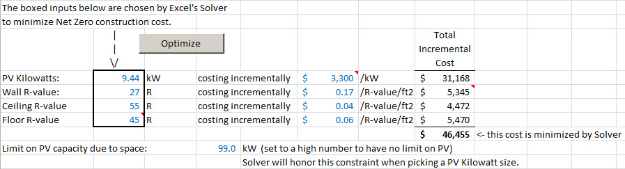

# Construction Cost Optimizer for Net Zero Homes

This is a Microsoft Excel model for determining the levels of insulation and PV (Solar) panels that minimize the construction cost of a Net Zero Energy home.  This model was born out of Net Zero discussions amongst members of the [Alaska Center for Appropriate Technology](http://acat.org/).

[Click here to Download the Excel Net Zero Energy Optimizer Model](Net-Zero-Optimizer.xlsm?raw=true)  
When you open the Excel workbook, you need to click the button at the top of the workbook to "Enable Content" (Macros), as the workbook has a macro attached to the "Optimize" button.  Also, this workbook uses the Excel Solver Add-In, which is provided by Microsoft with Excel.  However, the Solver Add-In needs to be enabled according to these instructions (this only needs to done once for your installation of Excel):

<a href="https://support.office.com/en-sg/article/Load-the-Solver-Add-in-0e6760e3-dab5-4fd4-bebb-15ee311a4316" target="_blank">Instructions for Loading the Excel Solver Add-In</a>

The blue numbers in the model are inputs that can be changed by the user.  Black numbers are formulas, which are calculated from the user inputs.

The model accounts for the Lights and Appliances energy use, Space Heating energy use, Domestic Water Heating energy use, and Solar Electric production of a home.  The model has an optimize feature that will try various combinations of four home characteristics to reduce the net energy use of the home to zero while minimizing the construction cost of the home.  All of the other home characteristics that affect energy use are not currently involved in the optimization process but could be added as the model evolves.  These other characteristics of the home are manually entered by the user. For example, the user can enter in a Window R-value of 6.0; the optimization process will not change that value.

The four characteristics that are controlled by the optimization are:

* The kilowatt capacity of the Photovoltaic Solar system (PV system).
* The insulating R-value of the Walls.
* The insulating R-value of the Ceiling.
* The insulating R-value of the Floor.

Numerous combinations of these characteristics can result in Net Zero energy use.  Relatively low levels of insulation can be combined with large amounts of PV capacity to produce a Net Zero home.  Or, high insulation and more modest amounts of PV panels can be used to be Net Zero.  The optimization process in the model picks the combination that minimizes the construction cost of the home.  Simple, linear cost estimates are used for these four energy features of the home.

Here is a screen shot of the key values that are optimized and the cost inputs associated with those characteristics:

The thick bordered box on the left highlights the four characteristics that are manipulated in the optimization process.  The gray "Optimize" button starts the optimization, and Excel finds the cost-minimizing values for the PV capacity and the three R-values.  In this example, the home reached net zero and minimized construction cost with 9.44 kW of PV, R-27 Walls, R-55 ceilings, and R-45 floors (the model simplifies and assumes all R-values and PV outputs are possible.  The model could be modified to only allow certain discrete possibilities.)

Note that you can manually type in values for the four characteristics to test out your own possible solutions.  These values will be over-written by the Solver if you later run the Optimize feature.  When you do run the Optimize feature, make sure the starting values in the cells are reasonable or Solver may have difficulty finding a solution.

## Incremental Construction Costs

It is important to understand the meaning of the cost values shown in the screen shot.  The optimization involves trying various values of PV output and R-values.  The test is whether increasing PV output by a certain amount and decreasing R-values results in lower costs while still maintaining net zero energy use.  The relevant cost characteristics are the *incremental costs* of adding/removing PV capacity and adding/removing R-value.  Any fixed costs of installing the PV system, such as the electrical connection costs, are not relevant because those costs are close to the same for all relevant levels of PV capacity.  Wall construction also has a number of fixed costs that are not related to the R-value of the wall (siding costs, sheetrock costs, etc).  These costs should be ignored when entering the incremental costs in the model.

In the example above, the incremental PV cost is shown as $3,300 / kW.  That means that the cost of adding an additional section of panels and associated inverters/racking to the system divided by the extra capacity provided by those panels is $3,330 per kW added.  The incremental Wall R-value cost is shown as $0.17 / R-value / square foot.  This figure is consistent with adding an additional R-10 to the wall design for a cost of $1.70/square-foot:   `$1.70/ft2 / R-10 = $0.17/R-value/ft2`.  These cost numbers have not been researched thoroughly and depend on the design of these components.  But, $0.17/R-value/ft2 is an estimate reasonably consistent with a wall using rigid foam to achieve additional R-value beyond that provided by a batt or cellulose-filled wall cavity.  For some calculations related to the incremental cost of wall R-value, see this spreadsheet:

[Calculations Related to Incremental Wall R-Value Costs](Incremental-Insulation-Costs.xlsx?raw=true)

One common situation where these linear cost estimates break down is when there is limited space to install a PV system.  Available roof space will be exceeded at some point, and additional capacity is either not possible or must be more-expensively ground mounted.  The model can somewhat accommodate this situation through use of the "Limit on PV capacity due to space" input shown above.  If you know that you can only install as much as 8 kW of PV on your roof, then you can enter this 8 kW limit for this input.  When the optimization is run, it will limit the amount of PV capacity used (the optimizer may choose to use less than the limit value if doing so minimizes costs).  Note that if you set this limit too low, the Excel Solver may not be able to find a solution that results in Net Zero energy use.  No level of Wall/Floor/Ceiling R-values will be able to drop energy use to net zero with the limited amount of PV capacity.

## Energy Models

This spreadsheet includes simple energy models to estimate the amount of fuel and/or electricity used for Space Heating, Domestic Hot Water, and Lights/Appliances.  No air conditioning energy use is modeled, and the Space Heating model used is a simple one appropriate only for nothern climates such as Alaska.  These models are not meant for accurate design of a net zero home, but they are useful for approximately estimating the characteristics of a net zero home and for approximately optimizing the tradeoff between home insulation and PV capacity.

The Space Heating model estimates total annual gross heat loss from the building and then deducts usable internal and usable solar gains.  The model does estimate the magnitude of the gross internal gains, but you must enter the *usability* of those gains, i.e the portion of those gains that offset heat load that must be supplied by the heating system.  In Alaska, internal gain usability is generally high, in excess of 95%.  The Energy Flows report in the [AkWarm modeling software](http://analysisnorth.com/AkWarm/AkWarm2download.html) can provide an estimate of internal gain usability for your specific home.  Also, the NZE optimizer model requires entry of the annual usable solar gain for your home; this is another value that can be found on the AkWarm Energy Flows report, or from a different energy modeling program.  Here is an AkWarm file for the sample home used in the model:

[Sample Home](Optimizer-Test-House.hm2?raw=true)

The model allows you to choose the fuel type used for Space Heating and separately for Domestic Hot Water.  As well as selecting the fuel type, you need to enter a seasonal efficiency for the heating system.

The Optimize feature of the model will choose a set of insulation and PV capacity values that minimize cost and achieve net zero energy use.  You can select whether you want to use a Source or a Site energy use standard for determining net zero.  If you choose to use Source energy, the model uses Site-to-Source multipliers that are entered on the "Support" sheet of the model.  The values currently present there are the DOE source multipliers.

Note that the model does not consider the reduction in heating system capital costs that can sometimes occur with higher insulation levels and reduced heating loads.  Considering these costs reductions could lead to optimal insulation levels higher than those calculated by this model.

## Analyzing Other Economic Trade-offs

The model can only automatically optimize the four variables described previously.  However, you can use the model to examine other economic trade-offs related to designing a net zero home.  Here is an example.  Say that you want to determine whether it will reduce the cost of the net zero home by installing a solar domestic hot water heater that supplies 60% of the DHW load.  First, run the Optimize feature of the model with the full domestic hot water load.  For the sample home, this load (prior to heating system losses) is 11.8 MMBtu/year.  After running Optimize, the total cost shown in cell H20 is **$46,455**.  Now, enter a hot water load that is 60% less:  `11.8 MMBtu * 0.4 = 4.7 MMBtu`.  Rerun the Optimize feature and examine the new total cost in cell H20.  The new cost is **$43,429**; the cost has decreased due to being able to downsize the PV capacity and still meet net zero.  The difference between these two cost figures is:  $46,455 - $43,429 = **$3,026**.  If you can install the solar hot water system for less than this amount (unlikely), the overall cost of the net zero home will be reduced.
